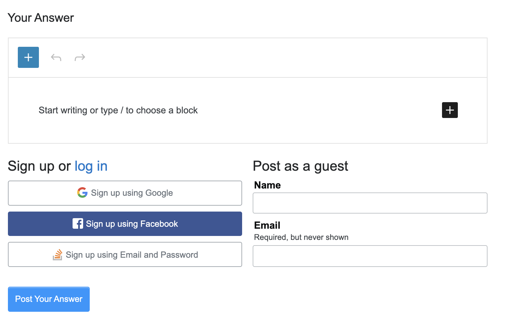

# Gutenberg Chrome Extension

A Chrome extension that adds a button to the toolbar. When the button is clicked it will convert every `textarea` on the page to a Gutenberg editor.

The editor will load and save content to the `textarea` in Markdown format, making it compatible with a variety of sites. Here's Gutenberg on Stack Overflow:

Note that this is a proof of concept.

The extension uses the [Isolated Block Editor](https://github.com/Automattic/isolated-block-editor/). This can also be found in:

- [Plain Text Editor](https://github.com/Automattic/isolated-block-editor/src/browser/README.md) - standalone JS file that can replace any `textarea` on any page with a full Gutenberg editor
- [Gutenberg Everywhere](https://github.com/Automattic/gutenberg-everywhere/) - a WordPress plugin to add Gutenberg to comments, WP admin pages, bbPress, and BuddyPress
- [Gutenberg Desktop](https://github.com/Automattic/gutenberg-desktop/) - a desktop editor that supports the loading and saving of HTML and Markdown files
- [P2](https://wordpress.com/p2/) - WordPress as a collaborative workspace (coming soon for self-hosted)

## Development

The editor is found in `src`, with the Chrome code in `extension/background.js` and `manifest.json`.

Running `yarn start` will build the development version of the extension. See the *Installing* section for details of how to load the extension. You will need to refresh the extension each time a change is made.

## Releases

Pre-built versions can be found in the [releases](https://github.com/Automattic/gutenberg-everywhere-chrome/releases) section. Follow the *Installing* instructions for details about loading an extension into Chrome.

To distribute a release on Github:
- Ensure `GITHUB_TOKEN` has been set with a [personal access token](https://github.com/settings/tokens/new?scopes=repo) for this repo.
- `yarn dist` will build, zip, and upload the release to this repo

## Installing

You can install the development build by:
- `yarn start`
- From the Chrome extensions page you can switch to 'developer mode' and then 'Load unpacked'. Select the main Gutenberg Everywhere Chrome directory and it will load the extension.

You can install a release build by:
- `yarn build`
- `yarn release`
- From the Chrome extensions page you can switch to 'developer mode' and then 'Load unpacked'. Select the `release` directory and it will load the extension.
